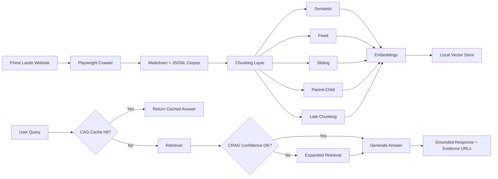

# 🏡 Real Estate Intelligence Platform for Prime Lands

<p align="center">
  
  
  
  
  
  
</p>

> A notebook-driven, config-first Retrieval-Augmented Generation platform that crawls Prime Lands web content, transforms it into a searchable knowledge base, and serves grounded answers through standard RAG, Cache-Augmented Generation (CAG), and Corrective RAG (CRAG).

## ✨ Project Snapshot

This repository implements an end-to-end real estate intelligence workflow for **Prime Lands Sri Lanka**:

- 🌐 Crawls JavaScript-rendered Prime Lands pages with **Playwright**
- 🧹 Converts raw HTML into clean **Markdown + JSONL corpora**
- ✂️ Chunks documents with **5 different retrieval strategies**
- 🧠 Embeds content and persists a local **vector index**
- 💬 Answers user questions using **modern LCEL-based RAG**
- ⚡ Accelerates repeated queries using **semantic caching**
- 🎯 Improves weak retrieval using **confidence-based corrective retrieval**
- ⚙️ Centralizes behavior in reusable **YAML configuration**

## 🎯 Why This Project Matters

The platform demonstrates how to move from raw, unstructured website data to a production-style question-answering workflow tailored for a specific business domain.

For Prime Lands, that means transforming property pages, project pages, contact information, and listing content into a grounded AI assistant that can:

- answer property and project questions from website evidence
- surface source-backed responses instead of generic LLM guesses
- support repeated FAQ traffic with low-latency cache hits
- experiment with multiple retrieval strategies for better search quality

## 🧠 Skills Demonstrated

This project showcases practical strength across the full applied AI stack:

- **Data acquisition engineering** with BFS crawling, rendering waits, content extraction, and URL filtering
- **LLM application engineering** with prompt templates, grounding rules, evidence formatting, and answer orchestration
- **Retrieval engineering** with multi-strategy chunking, vector indexing, semantic search, and corrective retrieval
- **Context engineering** through config-driven chunk sizing, retrieval depth, cache thresholds, and prompt structure
- **MLOps-oriented design** with reusable config files, environment-based secrets, packaged dependencies, and artifact persistence
- **Applied NLP pipeline design** using token counting, Markdown-aware splitting, heuristic confidence scoring, and semantic similarity
- **Experiment-driven workflow** through three notebooks that separate crawl, indexing, and chat evaluation stages

## 🏗️ End-to-End Architecture



## 🚀 What Has Been Implemented

### 1. 🌐 Web Crawling and Corpus Creation

Implemented in [`src/application/ingest_document_service/web_crawler.py`](./src/application/ingest_document_service/web_crawler.py) and orchestrated in [`notebooks/01_crawl_primelands.ipynb`](./notebooks/01_crawl_primelands.ipynb).

**Implemented capabilities**

- Async **Playwright** crawler for JavaScript-rendered pages
- **Breadth-first crawling** with depth control
- **Internal-link discovery** limited to the Prime Lands domain
- Content filtering for excluded routes such as login, privacy, admin, and media paths
- Noise removal for `script`, `style`, `nav`, `footer`, `aside`, `noscript`, and `iframe`
- HTML-to-Markdown conversion using **markdownify**
- Metadata extraction for:
  - page title
  - headings
  - crawl depth
  - discovered links
- Windows-safe event loop handling for Jupyter + Playwright compatibility

**Notebook crawl defaults**

| Parameter | Value |
|---|---:|
| Start URLs | 14 |
| Max depth | 3 |
| Request delay | 2.0 seconds |
| Base domain | `https://www.primelands.lk` |

**Persisted outputs**

- `data/primelands_docs.jsonl`
- `data/primelands_markdown/*.md`

### 2. ✂️ Multi-Strategy Chunking

Implemented in [`src/application/ingest_document_service/chunkers.py`](./src/application/ingest_document_service/chunkers.py) and demonstrated in [`notebooks/02_chunk_and_embed.ipynb`](./notebooks/02_chunk_and_embed.ipynb).

The project does not rely on a single chunking style. Instead, it implements **five retrieval-oriented chunking strategies** to compare recall, precision, and context richness.

| Strategy | Purpose | Configured Behavior |
|---|---|---|
| `semantic_chunk` | Preserve topic structure | Markdown heading-aware split, min `200`, max `1000` tokens |
| `fixed_chunk` | Create uniform chunks | `800` token chunks with `100` token overlap |
| `sliding_chunk` | Improve recall | `512` token windows with `256` token stride |
| `parent_child_chunk` | Combine precision + context | parent `1200`, child `250`, child overlap `50` |
| `late_chunk_index` + `late_chunk_split` | Retrieval-time refinement | base `1000`, split `300`, context window `150` |

**Supporting implementation details**

- token counting via **tiktoken**
- Markdown-aware splitting using **MarkdownHeaderTextSplitter**
- recursive fallback splitting using **RecursiveCharacterTextSplitter**
- chunk metadata carries URL, title, strategy, chunk index, and strategy-specific details

### 3. 🔎 Embeddings and Vector Indexing

Implemented in [`src/infra/llm_providers/embeddings.py`](./src/infra/llm_providers/embeddings.py) and notebook-driven in [`notebooks/02_chunk_and_embed.ipynb`](./notebooks/02_chunk_and_embed.ipynb).

**Implemented capabilities**

- Embedding factory abstraction for:
  - direct **OpenAI**
  - **OpenRouter** using OpenAI-compatible endpoints
- Configurable embedding tiers:
  - `default`: `text-embedding-3-large`
  - `small`: `text-embedding-3-small`
- Batch embedding control from config
- Local vector persistence under `data/vectorstore`

**Index build behavior**

- Notebook 02 combines:
  - semantic chunks
  - fixed chunks
  - sliding chunks
  - parent-child child chunks
  - late-chunk base passages
- Uses **QdrantVectorStore** to build the persisted collection `primelands`
- Performs a similarity sanity check using the query `kiribathgoda apartments`

### 4. 💬 RAG, CAG, and CRAG Service Layer

Implemented in [`src/application/chat_service`](./src/application/chat_service) and demonstrated in [`notebooks/03_chat_with_web_demo.ipynb`](./notebooks/03_chat_with_web_demo.ipynb).

#### Standard RAG

Implemented in `rag_service.py`.

- Uses **LangChain Expression Language (LCEL)** rather than legacy chain helpers
- Builds a runnable pipeline with:
  - retriever
  - parallel context/question flow
  - prompt template
  - chat model
  - output parser
- Returns:
  - generated answer
  - evidence documents
  - unique evidence URLs
  - generation timing
  - document count
- Supports standard generation, batch generation, and streaming

#### Corrective RAG (CRAG)

Implemented in `crag_service.py`.

- Calculates retrieval confidence from:
  - keyword overlap
  - content richness
  - chunk-strategy diversity
- Uses a configurable confidence threshold
- Expands retrieval from `top_k=4` to `expanded_k=8` when confidence is weak
- Regenerates the final answer with stronger evidence
- Exposes confidence analysis utilities for debugging retrieval quality

#### Cache-Augmented Generation (CAG)

Implemented in `cag_cache.py` and `cag_service.py`.

- Semantic cache backed by embeddings + cosine similarity
- Two-tier cache design:
  - **static FAQ cache**
  - **dynamic history cache**
- Cache features:
  - configurable similarity threshold (`0.90`)
  - configurable history TTL (`24h`)
  - cache size control
  - FAQ warming workflow
  - hit/miss tracking
  - persisted cache artifacts
- Persists cache state as:
  - `data/cag_cache/cag_faqs.pkl`
  - `data/cag_cache/cag_history.pkl`
- Supports near-instant responses for semantically similar repeated questions

### 5. 🧾 Prompting and Domain Models

Implemented in [`src/domain/prompts/rag_templates.py`](./src/domain/prompts/rag_templates.py), [`src/domain/models.py`](./src/domain/models.py), and [`src/domain/utils.py`](./src/domain/utils.py).

**Implemented pieces**

- RAG prompt template with grounding rules and inline citation expectations
- System header for assistant behavior control
- Domain entities for:
  - `Document`
  - `Chunk`
  - `Evidence`
  - `RAGQuery`
  - `RAGResponse`
- Retrieval utility functions for:
  - context formatting
  - heuristic confidence scoring
  - citation extraction
  - answer preview truncation

### 6. ⚙️ Config-Driven Design

Implemented through:

- [`config/config.yaml`](./config/config.yaml)
- [`config/models.yaml`](./config/models.yaml)
- [`config/faqs.yaml`](./config/faqs.yaml)
- [`src/config.py`](./src/config.py)

**Configurable concerns**

- provider selection
- model tier selection
- LLM defaults
- embedding defaults
- chunk sizing
- retrieval `top_k`
- similarity thresholds
- CAG cache TTL and size
- CRAG thresholds
- crawl depth and rate limits
- storage paths
- logging flags

The configuration layer also resolves secrets from environment variables and creates required working directories at runtime.

## 📒 Notebook Workflow

### `01_crawl_primelands.ipynb`

Purpose: crawl Prime Lands content and build the raw knowledge corpus.

**What happens inside**

- environment and API key loading
- config validation and directory setup
- crawler initialization
- domain crawl execution
- markdown export
- JSONL corpus export
- quality checks with random document inspection

### `02_chunk_and_embed.ipynb`

Purpose: transform the crawled corpus into chunked retrieval units and create a local vector index.

**What happens inside**

- corpus loading from `primelands_docs.jsonl`
- vector directory cleanup
- execution of all 5 chunking strategies
- JSONL export for each chunking output
- sample chunk spot checks
- embedding generation
- vector store build
- index sanity test

### `03_chat_with_web_demo.ipynb`

Purpose: compare retrieval-generation strategies and run interactive question answering.

**What happens inside**

- vector store connection
- LLM + embedding initialization
- RAG service initialization
- semantic cache initialization
- FAQ loading from config
- CRAG initialization
- interactive question-answer loop
- RAG vs CAG vs CRAG comparison
- cache-performance demonstration

## 📊 Current Repository Snapshot

The checked-in repository already contains generated data artifacts from prior runs.

| Artifact | Current Count / Status |
|---|---:|
| Crawled JSONL documents | 24 |
| Markdown exports in `data/primelands_markdown` | 182 |
| Semantic chunks | 129 |
| Fixed chunks | 140 |
| Sliding chunks | 141 |
| Parent-child child chunks | 141 |
| Parent-child parent chunks | 140 |
| Late-chunk base passages | 140 |
| FAQ seeds from config | 48 |

**Approximate indexing footprint**

- Total chunk records used by Notebook 02 for embedding: **691**
- Persisted local vector index: `data/vectorstore`
- Persisted semantic cache directory: `data/cag_cache`

### FAQ seed coverage

| FAQ Category | Count |
|---|---:|
| General | 5 |
| Properties | 8 |
| Locations | 6 |
| Services | 5 |
| Specific projects | 24 |

## 🧰 Configuration and Model Catalog

### Provider and model abstraction

The repository is designed around a provider abstraction instead of hardcoding a single API path.

`config/models.yaml` includes model catalogs for:

- OpenRouter
- OpenAI
- Anthropic
- Google
- Groq
- DeepSeek

`src/infra/llm_providers/llm_services.py` and `src/infra/llm_providers/embeddings.py` expose reusable factories that pull model IDs, API keys, and endpoint settings from config.

### Default runtime settings

| Area | Default |
|---|---|
| Provider | `openai` |
| Model tier | `general` |
| Chat model | `gpt-4o-mini` |
| Embedding model | `text-embedding-3-large` |
| LLM temperature | `0.0` |
| Max tokens | `2000` |
| Retrieval top-k | `4` |
| CAG similarity threshold | `0.90` |
| CRAG confidence threshold | `0.6` |

## 🛠️ Tech Stack

| Layer | Tools / Libraries |
|---|---|
| Language | Python 3.12 |
| LLMs | OpenAI, OpenRouter |
| RAG framework | LangChain, LangChain Core, LCEL |
| Crawling | Playwright, BeautifulSoup, markdownify |
| Vector search | Qdrant, Chroma |
| Embeddings | OpenAI Embeddings |
| Text processing | tiktoken, langchain-text-splitters |
| Config | YAML, python-dotenv |
| Analysis / notebooks | Jupyter, IPyKernel, ipywidgets |
| Dev tooling | Black, Ruff, MyPy, Pytest, Coverage |

## 📁 Repository Structure

```text
.
├── config/
│   ├── config.yaml
│   ├── faqs.yaml
│   └── models.yaml
├── data/
│   ├── primelands_docs.jsonl
│   ├── primelands_markdown/
│   ├── chunks_*.jsonl
│   ├── vectorstore/
│   └── cag_cache/
├── notebooks/
│   ├── 01_crawl_primelands.ipynb
│   ├── 02_chunk_and_embed.ipynb
│   └── 03_chat_with_web_demo.ipynb
├── src/
│   ├── application/
│   │   ├── chat_service/
│   │   └── ingest_document_service/
│   ├── domain/
│   │   └── prompts/
│   ├── infra/
│   │   └── llm_providers/
│   └── config.py
├── pyproject.toml
├── requirements.txt
└── uv.lock
```

## 🧩 Core Source Modules

| Module | Responsibility |
|---|---|
| `src/config.py` | Loads YAML config, resolves env-based secrets, exposes runtime constants |
| `src/application/ingest_document_service/web_crawler.py` | Crawls and extracts Prime Lands website content |
| `src/application/ingest_document_service/chunkers.py` | Implements five chunking strategies and token counting |
| `src/application/chat_service/rag_service.py` | Standard LCEL-based retrieval-augmented generation |
| `src/application/chat_service/crag_service.py` | Confidence-aware corrective retrieval workflow |
| `src/application/chat_service/cag_cache.py` | Semantic cache with FAQ and history tiers |
| `src/application/chat_service/cag_service.py` | Cache-augmented generation orchestration |
| `src/infra/llm_providers/llm_services.py` | Chat model factory for provider-driven LLM access |
| `src/infra/llm_providers/embeddings.py` | Embedding model factory for vectorization |
| `src/domain/models.py` | Core domain entities for documents, chunks, evidence, and responses |
| `src/domain/utils.py` | Retrieval helpers for formatting, confidence, citations, and truncation |
| `src/domain/prompts/rag_templates.py` | RAG prompt templates and message builders |

## ▶️ Getting Started

### 1. Install dependencies

```bash
pip install -r requirements.txt
python -m playwright install chromium
```

### 2. Add environment variables

Create a `.env` file with at least one valid provider key:

```env
OPENROUTER_API_KEY=your_key_here
OPENAI_API_KEY=your_key_here
```

Optional provider keys supported by config:

- `ANTHROPIC_API_KEY`
- `GOOGLE_API_KEY`
- `GROQ_API_KEY`
- `DEEPSEEK_API_KEY`

### 3. Run the project notebooks in sequence

1. `notebooks/01_crawl_primelands.ipynb`
2. `notebooks/02_chunk_and_embed.ipynb`
3. `notebooks/03_chat_with_web_demo.ipynb`

## 💼 Project Strengths

This project stands out as more than a notebook demo because it combines:

- modular service-layer design under `src/`
- notebook-based experimentation for reproducible AI workflow stages
- configurable chunking and retrieval behavior
- multiple generation patterns instead of a single baseline RAG implementation
- reusable infra abstractions for models and embeddings
- persistent artifacts that make experimentation observable and debuggable

## 🧪 Engineering Quality Signals

The repository also includes engineering scaffolding that supports maintainability:

- `pyproject.toml` with optional dependency groups for `jupyter` and `dev`
- formatting configuration for **Black**
- lint rules for **Ruff**
- static type-checking configuration for **MyPy**
- test and coverage configuration for **Pytest** and **Coverage**
- `.gitignore`, lockfile, and dependency manifests for reproducible setup

## 📌 Implementation Notes

- Notebook 02 builds the persisted local vector index with **Qdrant**.
- Notebook 03 demonstrates chat retrieval and service orchestration layer.
- FAQ seeds are externalized in YAML and can be warmed into the semantic cache for faster responses.
- The project is structured as a strong applied AI prototype focused on retrieval quality, modularity, and experimentation.

## 🏁 Summary

This repository presents a complete applied GenAI workflow for a real estate domain:

- crawl domain-specific web data
- clean and structure the corpus
- compare advanced chunking strategies
- build a vector-backed knowledge base
- serve grounded answers with RAG, CAG, and CRAG
- manage behavior through configuration instead of hardcoded logic

As a portfolio project, it highlights practical capability in **LLM systems design, retrieval engineering, data pipelines, vector search, prompt orchestration, semantic caching, and notebook-led experimentation**.
